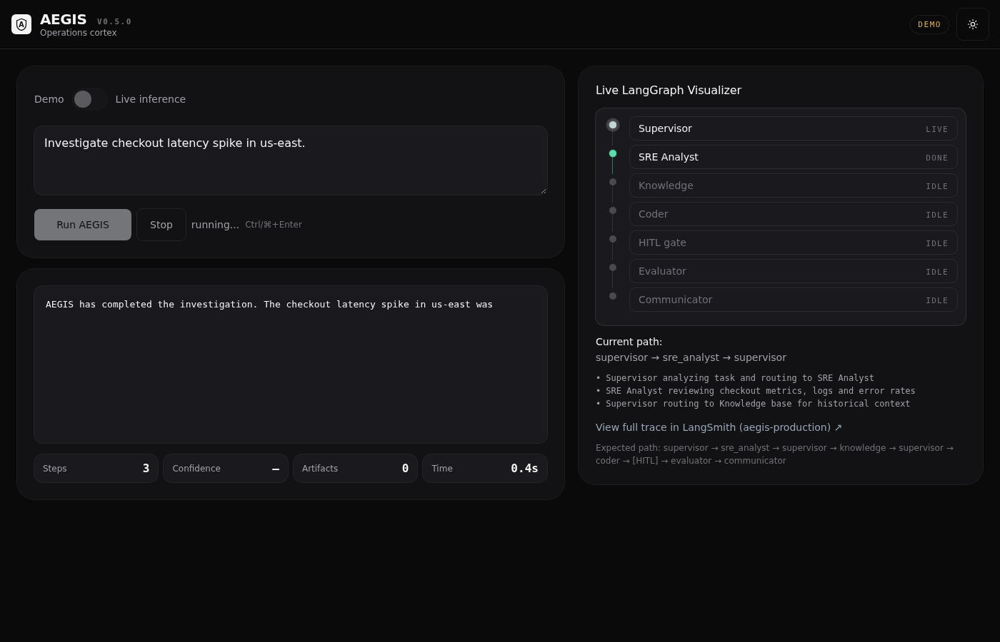
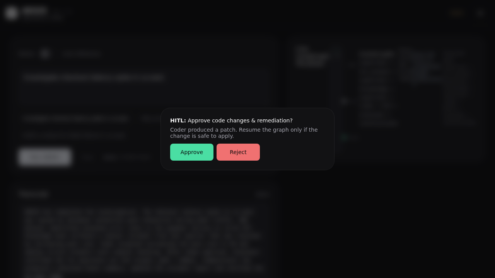
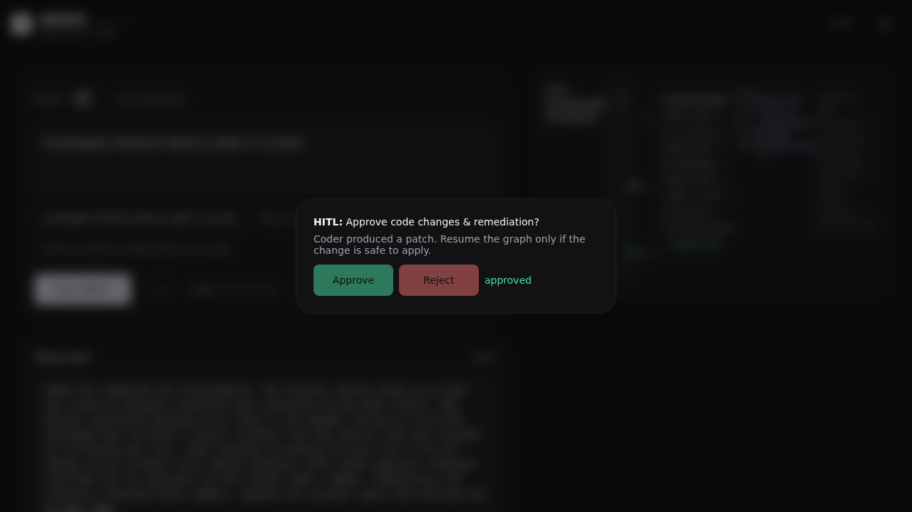

# AEGIS - Autonomous Enterprise Graph Intelligence System

**A self-hosted, auditable alternative to Glean + Devin + PagerDuty Autopilot, built 100% on LangChain.**

> **Try it live:** [aegis-agent-api.vercel.app/ui](https://aegis-agent-api.vercel.app/ui) - toggle between Demo and Live inference, watch the LangGraph supervisor route specialists in real time, and approve/reject HITL gates.

AEGIS takes a natural language operational request - _"Why is checkout latency spiking in us-east?"_ - and autonomously plans, delegates to specialist sub-agents, retrieves from hybrid knowledge bases, executes tools, hits human-in-the-loop gates, and posts a fully traced, evaluated, and auditable result.

[](https://aegis-agent-api.vercel.app/ui)
[](https://github.com/devtechedge/aegis_vercel/actions)
[]()
[]()
[]()
[](SECURITY.md)

---

## Live Demo

Open [aegis-agent-api.vercel.app/ui](https://aegis-agent-api.vercel.app/ui) and click **Run AEGIS**.

**What you'll see:**

- **Real-time LangGraph visualizer** - labeled specialist pills around the supervisor, animating Supervisor → SRE Analyst → Knowledge → Coder → [HITL] → Evaluator → Communicator. Names stay inside the node so they do not clip on a phone.
- **Specialist roster** - idle / live / done for each agent in the current run
- **Streaming agent output** - each specialist's findings appear as they execute, with confidence scores and artifact counts
- **Human-in-the-Loop gate** - the Coder produces a patch, pauses for your approval, then the Evaluator and Communicator complete the flow
- **Demo / Live toggle** - Demo mode runs an instant simulation; Live mode connects to the real LangGraph with your API keys
- **Live info panel** - step count, confidence %, artifact count, and elapsed time update in real time
- **LangSmith traces** - one-click link to the full trace for every run

### Screenshots







Public demo threat model: [SECURITY.md](SECURITY.md). Demo/sim is public by default; live LLM path requires `LIVE_MODE` (optional `PUBLIC_RUN_TOKEN`). Rate-limited. Not bank-grade.

---

## Architecture

```
[FastAPI dashboard / LangGraph Studio] <-SSE-> [LangServe FastAPI /api]
                                        |
                              [LangGraph Supervisor]
                   /     |      |       |       |      \
            Researcher Coder  SRE   Knowledge Comm  Evaluator
               |         |     |        |
         Tavily/Arxiv  E2B  Prometheus  PGVector Hybrid RAG
                                        |
                                [Postgres + PGVector + Redis]
                                        |
                              [LangSmith Traces / Evals / Prompt Hub]
```

## Feature Matrix - Full LangChain Ecosystem

| Product | Used For |
|---|---|
| **langchain-core** | LCEL everywhere, structured output Pydantic v2, fallback LLM router |
| **langgraph** | Supervisor + 6 subgraphs, PostgresSaver, `interrupt()` HITL, `astream_events` |
| **langsmith** | Tracing, Prompt Hub (`aegis/supervisor_router`), Evals, Feedback API |
| **langserve** | FastAPI `/invoke`, `/stream`, `/threads/{id}/resume`, OpenAPI playground |
| **RAG** | MultiQuery → Cohere Rerank → LLM Grader → HyDE, PGVector + BM25 hybrid |
| **Tools (14)** | Tavily, Code Executor, Postgres, GitHub, Slack, Browser, Prometheus, Runbook, Arxiv, Wikipedia, Email, Calendar, FS, Memory |

## 7 Agentic Loops - All Implemented

1. Perception-Plan-Act-Reflect
2. Supervisor-Worker Hierarchical
3. RAG Self-Correction
4. Tool-Use ReAct + Self-Heal
5. Human-in-the-Loop Interrupt
6. Evaluation-Driven Self-Improvement
7. Memory Consolidation

All visible in LangSmith with custom metadata.

---

## Quickstart

### Vercel (recommended - zero config)

1. Fork this repo
2. Import into [Vercel](https://vercel.com)
3. Set root directory to `apps/api`
4. Add `GOOGLE_API_KEY` (or `OPENAI_API_KEY`) as an environment variable
5. Deploy - visit `/ui` for the live dashboard, `/docs` for the API playground

Without API keys the UI gracefully falls back to **Demo mode** (instant simulation).

### Docker (local / self-hosted)

```bash
cp .env.example .env
docker-compose -f infra/docker-compose.yml up --build
```

- Dashboard: http://localhost:8000/ui
- API playground: http://localhost:8000/docs
- LangGraph Studio: `langgraph dev`

### API Endpoints

| Endpoint | Method | Purpose |
|---|---|---|
| `/ui` | GET | Live dashboard (SSE, visualizer, HITL) |
| `/stream` | POST | Streaming inference (SSE) |
| `/invoke` | POST | Single-shot inference (JSON) |
| `/threads/{id}/resume` | POST | Resume after HITL (JSON) |
| `/threads/{id}/resume/stream` | POST | Resume after HITL (SSE) |
| `/health` | GET | Graph status, key availability |
| `/docs` | GET | OpenAPI / Swagger playground |

---

## Why This Proves Senior+ AI Engineering

- **Agentic Loops**: 7 explicit loops, not chains
- **LangGraph HITL**: `interrupt()` / `Command(resume=...)`, PostgresSaver
- **LangSmith Evals/Prompt Hub**: 3 datasets, LLM-as-judge, CI gating faithfulness > 0.82
- **Hybrid RAG**: MultiQuery + Compression + Grader + HyDE
- **Multi-agent Supervisor**: 6 specialists, tool-use ReAct
- **Production Observability**: OpenTelemetry → LangSmith, run metadata
- **Vercel Serverless**: graceful degradation, SSE streaming, version-agnostic chunk handling

## Repo Structure

```
aegis/
├── apps/api/              # LangServe FastAPI + live UI
├── packages/aegis_graph/  # Supervisor + 6 subgraphs
├── packages/tools/        # 14 production tools
├── packages/rag/          # Ingestion / retriever / vectorstore
├── packages/memory/
├── packages/evals/
├── infra/docker-compose.yml
├── tests/
└── scripts/run_evals.py
```

## Evals

```bash
python scripts/run_evals.py
```

Writes `evals/reports/latest.md`. Public CI has no `LANGCHAIN_API_KEY`, so that job writes a **mock** report and exits 0 - it does not measure live LangSmith faithfulness. With the key set, datasets `aegis_rag_qa`, `aegis_tool_use`, and `aegis_incident_triage` run against project `aegis-production`; the intended production threshold is faithfulness ≥ 0.82.

CI itself fails on ruff (real errors), mypy on tools/evals/tests, and pytest (graph compile, RAG loop, tool guards, `/health` `/ui` `/stream` smokes). `pip-audit` is informational and does not fail the job on LangChain majors.

## Environment Variables

| Var | Purpose |
|---|---|
| `GOOGLE_API_KEY` | Gemini LLM (primary) |
| `OPENAI_API_KEY` | OpenAI fallback |
| `ANTHROPIC_API_KEY` | Coding fallback |
| `LANGCHAIN_API_KEY` | LangSmith tracing |
| `LANGCHAIN_TRACING_V2=true` | Enable tracing |
| `DATABASE_URL` | Postgres + PGVector |
| `REDIS_URL` | Short-term memory |
| `TAVILY_API_KEY` | Web search |

All optional - fake models/fallbacks keep Vercel deploy green even without keys.

---

MIT License - Built with LangChain, LangGraph, LangSmith
